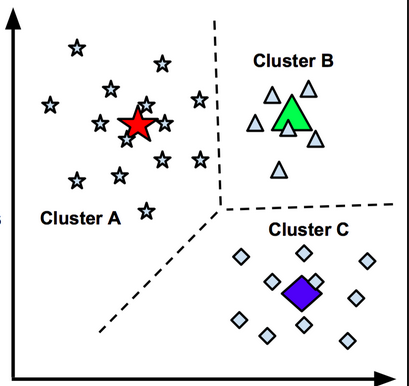

## Combine Aggregation Tables Using Left Join Command {.tabset}
### FtUnion
```{r Combine FtUnion Dataset}
# Join all the aggregation tables into a signle analysis dataset
df1_FtUnion <- left_join(
  BaseTable_FtUnion, PCD_FtUnion %>% select(-IsProtectedPhase),
  by = c("BinStartTime", "SignalId", "ApproachId"))

df2_FtUnion <- left_join(
  df1_FtUnion, SF_FtUnion %>% select(-IsProtectedPhase),
  by = c("BinStartTime", "SignalId", "ApproachId"))

df3_FtUnion <- left_join(
  df2_FtUnion, PPT_FtUnion, 
  by = c("BinStartTime", "SignalId", "ApproachId"))

df4_FtUnion <- left_join(
  df3_FtUnion, RA_FtUnion %>% select(-IsProtectedPhase),
  by = c("BinStartTime", "SignalId", "ApproachId"))

df5_FtUnion <- left_join(
  df4_FtUnion, Cyc_FtUnion,
  by = c("BinStartTime", "SignalId", "ApproachId"))

df6_FtUnion <- df5_FtUnion %>% 
  mutate(
    TotalTime = as.numeric(TotalTime),
    TotalGreenTime = as.numeric(TotalGreenTime),
    TotalYellowTime = as.numeric(TotalYellowTime),
    TotalRedTime = as.numeric(TotalRedTime),
    PercentGreen = as.numeric(PercentGreen)
  ) %>%
  mutate(
    AMPeak = hour(BinStartTime) >= 7 & hour(BinStartTime) <= 8
  )  %>%
  mutate(
    PercentAOG = (ArrivalsOnGreen + ArrivalsOnYellow) / TotalVolume,
    PercentAOR = ArrivalsOnRed / TotalVolume,
    SFPerCycle = SplitFailures / TotalCycles,
    RAPerCycle = TotalRedLightViolations / TotalCycles,
    PercentForceOffs = ForceOffs / TotalCycles
  )

dfFtUnion <- df6_FtUnion %>%
  write_rds("data/dfFtUnion.rds")
```

### 800N
```{r Combine 800N Dataset}
# Join all the aggregation tables into a signle analysis dataset
df1_800N <- left_join(
  BaseTable_800N, PCD_800N %>% select(-IsProtectedPhase),
  by = c("BinStartTime", "SignalId", "ApproachId"))

df2_800N <- left_join(
  df1_800N, SF_800N %>% select(-IsProtectedPhase),
  by = c("BinStartTime", "SignalId", "ApproachId"))

df3_800N <- left_join(
  df2_800N, PPT_800N, 
  by = c("BinStartTime", "SignalId", "ApproachId"))

df4_800N <- left_join(
  df3_800N, RA_800N %>% select(-IsProtectedPhase),
  by = c("BinStartTime", "SignalId", "ApproachId"))

df5_800N <- left_join(
  df4_800N, Cyc_800N,
  by = c("BinStartTime", "SignalId", "ApproachId"))

df6_800N <- df5_800N %>% 
  mutate(
    TotalTime = as.numeric(TotalTime),
    TotalGreenTime = as.numeric(TotalGreenTime),
    TotalYellowTime = as.numeric(TotalYellowTime),
    TotalRedTime = as.numeric(TotalRedTime),
    PercentGreen = as.numeric(PercentGreen)
  ) %>%
  mutate(
    AMPeak = hour(BinStartTime) >= 7 & hour(BinStartTime) <= 8
  )  %>%
  mutate(
    PercentAOG = (ArrivalsOnGreen + ArrivalsOnYellow) / TotalVolume,
    PercentAOR = ArrivalsOnRed / TotalVolume,
    SFPerCycle = SplitFailures / TotalCycles,
    RAPerCycle = TotalRedLightViolations / TotalCycles,
    PercentForceOffs = ForceOffs / TotalCycles
  )

df800N <- df6_800N %>%
  write_rds("data/df800N.rds")
```

### State Street
```{r}
df1_StateSt <- left_join(
  BaseTable_StateSt, PCD_StateSt %>% select(-IsProtectedPhase),
  by = c("BinStartTime", "SignalId", "ApproachId"))

df2_StateSt <- left_join(
  df1_StateSt, SF_StateSt %>% select(-IsProtectedPhase),
  by = c("BinStartTime", "SignalId", "ApproachId"))

df3_StateSt <- left_join(
  df2_StateSt, PPT_StateSt, 
  by = c("BinStartTime", "SignalId", "ApproachId"))

df4_StateSt <- left_join(
  df3_StateSt, RA_StateSt %>% select(-IsProtectedPhase),
  by = c("BinStartTime", "SignalId", "ApproachId"))

df5_StateSt <- left_join(
  df4_StateSt, Cyc_StateSt,
  by = c("BinStartTime", "SignalId", "ApproachId"))

df6_StateSt <- df5_StateSt %>% 
  mutate(
    TotalTime = as.numeric(TotalTime),
    TotalGreenTime = as.numeric(TotalGreenTime),
    TotalYellowTime = as.numeric(TotalYellowTime),
    TotalRedTime = as.numeric(TotalRedTime),
    PercentGreen = as.numeric(PercentGreen)
  ) %>%
  mutate(
    AMPeak = hour(BinStartTime) >= 7 & hour(BinStartTime) <= 8
  )  %>%
  mutate(
    PercentAOG = (ArrivalsOnGreen + ArrivalsOnYellow) / TotalVolume,
    PercentAOR = ArrivalsOnRed / TotalVolume,
    SFPerCycle = SplitFailures / TotalCycles,
    RAPerCycle = TotalRedLightViolations / TotalCycles,
    PercentForceOffs = ForceOffs / TotalCycles
  )

dfStateSt <- df6_StateSt %>%
  write_rds("data/dfStateSt.rds")
```

### Combine all DataSet
```{r}
dfFtUnion <- read_rds("data/dfFtUnion.rds") %>% mutate(Corrdior = "FtUnion")
df800N <- read_rds("data/df800N.rds") %>% mutate(Corrdior = "800N")
dfStateSt <- read_rds("data/dfStateSt.rds") %>% mutate(Corrdior = "StateSt")

dfCorridors_NA <- rbind(dfFtUnion, df800N, dfStateSt) %>%
  write_rds("data/dfCorridors_NA.rds")
```

## Methodology
### K-mean Cluster Analysis

 - Cluster analysis can help us group and weight all the variables for threshold values development. 
 - Clustering is a broad set of techniques for finding subgroups of observations within a data set. 
 - When we cluster observations, we want observations in the same group to be similar and observations in different groups to be dissimilar. 
 - It is an unsupervised method, which implies that it seeks to find relationships between the n observations without being trained by a response variable.
 - Clustering allows us to identify which observations are alike, and potentially categorize them therein. 

 