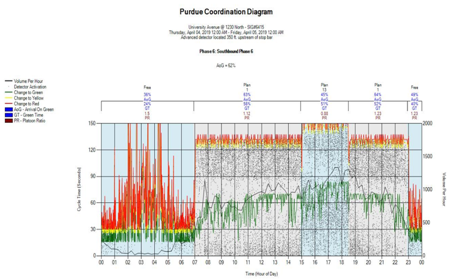

### Introduction {.tabset}

The purpose of this research is to evaluate the real-time data collected through the ATSPM database and determine which performance measures can be used for evaluation and to then identify thresholds for each performance measure chosen. The following sections include:

 - What is ATSPM
 - What are ATSPMs include
 - Problem Statement
 - Data Collection
 - Methodology
 - Conclusion

#### What is ATSPM

 - ATSPM is one of the technologies in the Intelligent Transportation System (ITS).
 - Automated Traffic Signal Performance Measures use detector data to show actual and historical performance of signalized intersection.
 - They use high-resolution data capability added to existing infrastructure to evaluate the quality of progression of traffic along a corridor.
 - The data provide insight into vehicle delay from volume, speed, and travel time detection. 
 - UDOT uses the data to optimize mobility and manage traffic signal timing and maintenance to reduce congestion, save fuel costs, and improve safety (UDOT, 2019b)

#### What Are ATSPMs include

  - Force Offs and Gap Outs
  - Split Failures
  - Pedestrain Delay
  - Turning Movement Counts
  - Arrivals on Green, Red, and Yellow
  - Approach Volume, Speed, and Delay
  - Yellow and Red Light Violation
  
  

#### Problem Statement

  - UDOT has taken an active role in evaluating and monitoring traffic performance throughout the State since 2014.
  - For the UDOT system, it has approximately 2040 traffic signals bringing back about 1 TB of data per month. (33.3 GB of data per day)
  - The Purpose of my research is to evaluate the real-time data collected through the ATSPM database.
  - Determine which performance measures can be used for evaluation and then to identify thresholds for each performance measure chosen. 
